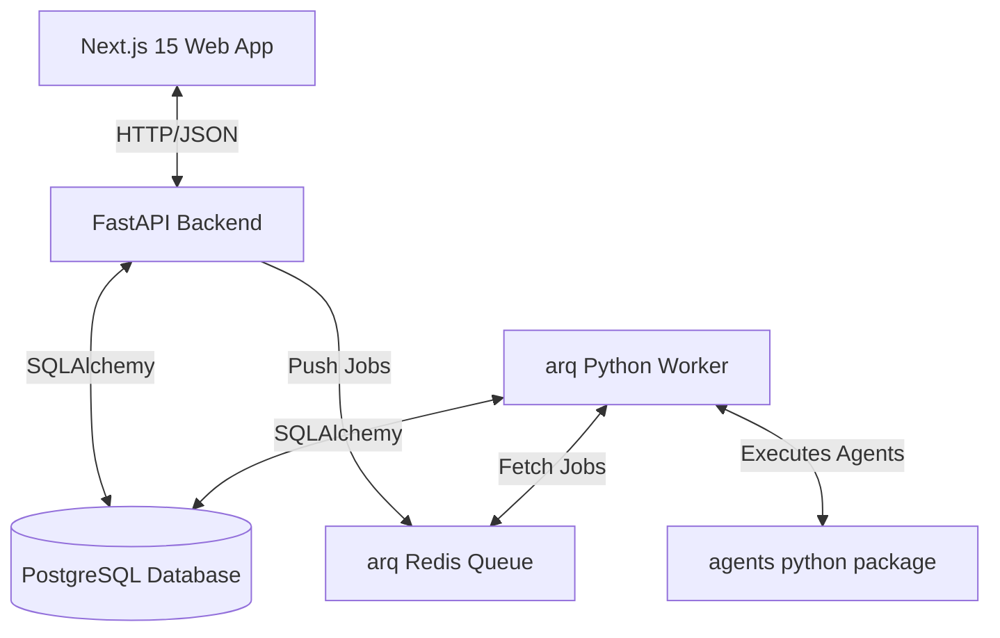

# Shaily Studio - AI Content OS

Shaily Studio is a production-grade personal Artificial Intelligence Content Operating System. It is custom-tailored for a **single user (the Founder)** to manage, orchestrate, and coordinate automated content creation pipelines (ideation, scriptwriting, and editing coordination). 

---

## 1. Architecture

The system is configured as a modular monorepo to isolate frontend representations, API services, background task workers, and Python AI agent frameworks.



---

## 2. Folder Structure

```text
shaily-studio/
├── apps/
│   ├── web/               # Next.js 15 App (Zustand, React Query, Tailwind v4)
│   ├── api/               # FastAPI Backend Service (Python 3.12, SQLAlchemy, Alembic)
│   └── worker/            # Background Worker Queue processor (arq + Redis)
├── packages/
│   ├── core/              # Shared TS utilities, constants, agent configs
│   ├── shared/            # Common TS types and interface schemas
│   ├── ui/                # Shared Radix / Tailwind CSS component framework
│   ├── config/            # Shared compiler & linter configurations
│   └── agents/            # Core Python package defining BaseAgent and executors
├── database/              # DB schemas and Alembic database migration environment
├── docker/                # Isolated Dockerfiles for Web, API, and Worker
├── scripts/               # PowerShell/Shell scripts for local orchestration
├── docs/                  # System design manuals and architectural specs
├── storage/               # Local media cache and file-system assets
├── logs/                  # Runtime server and queue worker files
├── assets/                # Design assets and media logos
└── tests/                 # Testing suites
```

---

## 3. Setup

### System Prerequisites
Ensure the following packages are installed on your host system:
* **Node.js** (v22.0.0+) & **pnpm** (v11.0.0+)
* **Python** (3.12+)
* **Docker & Docker Compose**

### Quickstart Installation

1. Clone the repository and navigate to the project directory:
   ```bash
   cd "c:\Users\asus\AI video OS\shaily studio"
   ```

2. Run the automated initialization script:
   * **Windows PowerShell**:
     ```powershell
     .\scripts\setup.ps1
     ```
   * **Unix / macOS**:
     ```bash
     chmod +x scripts/setup.sh
     ./scripts/setup.sh
     ```

---

## 4. Development Commands

### Docker Orchestration (Recommended)
Launch the entire stack (PostgreSQL, Redis, Web App, API, Worker) inside isolated containers with live-reload enabled:
* **Windows**:
  ```powershell
  .\scripts\run-dev.ps1
  ```
* **Unix**:
  ```bash
  ./scripts/run-dev.sh
  ```

### Local CLI Commands

To run packages outside Docker Compose, use these root pnpm shortcuts:

| Command | Action |
|---|---|
| `pnpm install` | Install all TS workspace package dependencies |
| `pnpm run dev` | Launch the Next.js web application on port `3000` |
| `pnpm run build` | Compile all TypeScript apps and libraries in the workspace |
| `pnpm run lint` | Run ESLint across all JS/TS projects |
| `pnpm run format` | Run Prettier code formatting on the entire workspace |

---

## 5. Coding Standards & Project Rules

* **Modular Framework**: Every package under `packages/` is strictly encapsulated. Code must communicate via exported APIs; never import files directly across package boundaries.
* **Strict Type Safety**: All TypeScript files must compile under TypeScript strict mode. Python codebases must be strictly typed using `pydantic` schemas.
* **No Business Placeholders**: Avoid hardcoded values in core configurations. Declare parameters inside `.env` and load them through `settings` configurations.
* **Keep Code Single-Responsibility**: Do not write large files. Ensure every database connection, agent implementation, or page component serves one single duty.
* **AI Architecture Readiness**: Extend the Python agent registry `packages/agents` to hook into future automation services.
